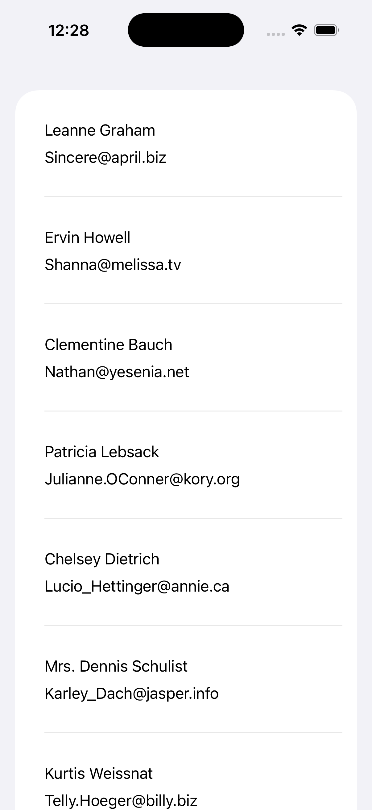
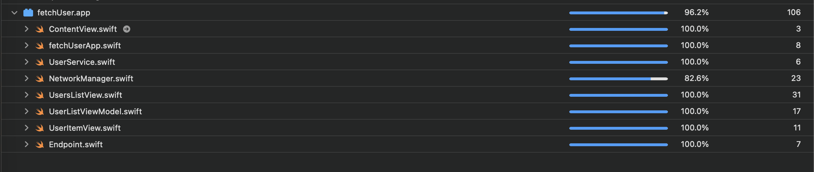

# FetchUserDemo

// A SwiftUI application to fetch and display user data, built with a focus on clean architecture and robust test coverage.

// Architecture

// This project uses the Model-View-ViewModel (MVVM) architecture with SwiftUI:

// - Model: Represents the application's data structures (e.g., User, UserListItemViewModel).
// - View: SwiftUI views (e.g., UsersListView, UserItemView) responsible for the UI layer and rendering data provided by the ViewModel.
// - ViewModel: (e.g., UserListViewModel) Handles presentation logic, business rules, and coordinates between Views and Models. Uses @Published properties to update Views reactively.
// - Services & Networking: Classes like UserService abstract API calls and data fetching.
// - Testing: Includes mocks and snapshot testing for UI, plus unit tests for services and view models.

// Testing & Coverage

// - The project is thoroughly tested with both unit and UI snapshot tests.
// - Mock services and mock view models are used for isolated and deterministic tests.
// - Test coverage is above 80%.

// Getting Started

// 1. Clone the repository.
// 2. Open the Xcode project and build.
// 3. Run the tests (⌘U) to verify coverage and correctness.

// ---

// Feel free to explore the codebase and contribute!
